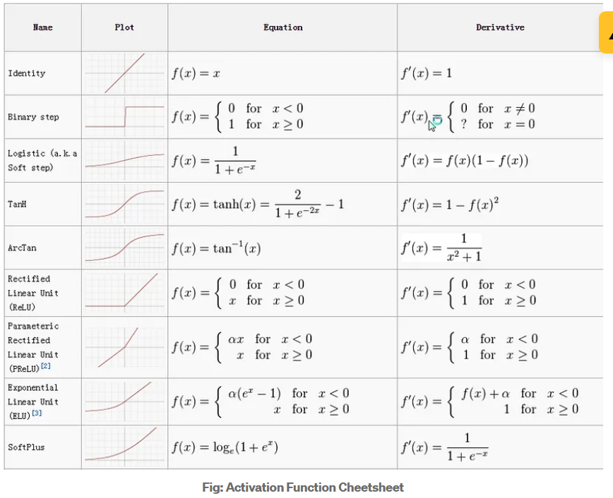
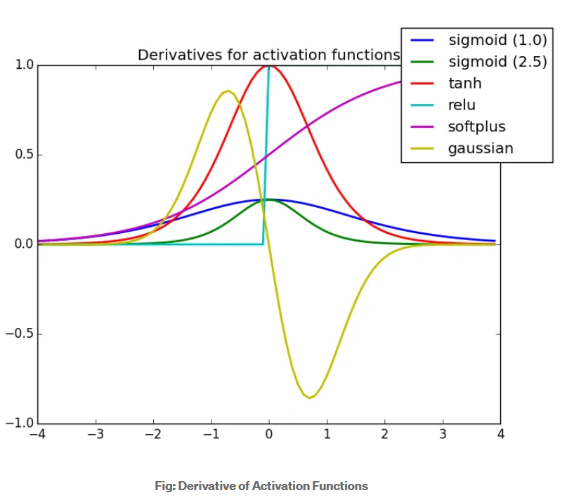

In neural networks (NN), an **activation function** is a mathematical function applied to a node's output to introduce non-linearity into the model. This non-linearity allows the network to learn and model more complex patterns and relationships in the data. Without activation functions, a neural network would simply be a linear regression model, regardless of its depth.

### Common Types of Activation Functions

1. **Linear Activation Function**
   - **Formula**: \( f(x) = x \)
   - **Use**: Rarely used in hidden layers; more commonly used in output layers for regression tasks.
   - **Pros**: Simple.
   - **Cons**: No non-linearity; cannot capture complex patterns.

2. **Sigmoid Activation Function**
   - **Formula**: \( f(x) = \frac{1}{1 + e^{-x}} \)
   - **Use**: Often used in binary classification tasks.
   - **Pros**: Outputs values in the range (0, 1), interpretable as probabilities.
   - **Cons**: Can cause vanishing gradient problem, slow convergence.

3. **Tanh (Hyperbolic Tangent) Activation Function**
   - **Formula**: \( f(x) = \tanh(x) = \frac{e^x - e^{-x}}{e^x + e^{-x}} \)
   - **Use**: Often used in hidden layers.
   - **Pros**: Outputs values in the range (-1, 1); zero-centered.
   - **Cons**: Can also cause vanishing gradient problem.

4. **ReLU (Rectified Linear Unit) Activation Function**
   - **Formula**: \( f(x) = \max(0, x) \)
   - **Use**: Commonly used in hidden layers.
   - **Pros**: Simple, computationally efficient, helps mitigate vanishing gradient problem.
   - **Cons**: Can cause "dying ReLU" problem where neurons become inactive and only output zero.

5. **Leaky ReLU Activation Function**
   - **Formula**: \( f(x) = x \) if \( x \geq 0 \), \( f(x) = \alpha x \) if \( x < 0 \) (where \( \alpha \) is a small positive value, often 0.01)
   - **Use**: Alternative to ReLU to avoid "dying ReLU" problem.
   - **Pros**: Allows a small, non-zero gradient when the unit is not active.
   - **Cons**: Slightly more complex than ReLU.

6. **Parametric ReLU (PReLU) Activation Function**
   - **Formula**: \( f(x) = x \) if \( x \geq 0 \), \( f(x) = \alpha x \) if \( x < 0 \) (where \( \alpha \) is a learned parameter)
   - **Use**: Similar to Leaky ReLU but with a learnable parameter.
   - **Pros**: Adaptive; can learn the best value for \( \alpha \) during training.
   - **Cons**: Adds additional parameters to learn.

7. **Softmax Activation Function**
   - **Formula**: \( f(x_i) = \frac{e^{x_i}}{\sum_{j} e^{x_j}} \)
   - **Use**: Often used in the output layer of classification networks for multi-class problems.
   - **Pros**: Outputs a probability distribution across multiple classes.
   - **Cons**: Computationally expensive for large number of classes.

8. **Swish Activation Function**
   - **Formula**: \( f(x) = x \cdot \text{sigmoid}(x) \)
   - **Use**: Developed by Google; used in some recent deep learning architectures.
   - **Pros**: Smooth and non-monotonic; can improve model performance.
   - **Cons**: More computationally complex than ReLU.

### Choosing an Activation Function
The choice of activation function can significantly impact the performance of a neural network. Common practices include:

- Using **ReLU** or its variants (Leaky ReLU, PReLU) for hidden layers.
- Using **sigmoid** for binary classification output layers.
- Using **softmax** for multi-class classification output layers.
- Considering **tanh** for hidden layers if zero-centered outputs are desired.
- Experimenting with newer activation functions like **Swish** for potential performance improvements.

The selection often depends on the specific problem, the architecture of the neural network, and empirical testing.

Why derivative/differentiation is used ?
When updating the curve, to know in which direction and how much to change or update the curve depending upon the slope.That is why we use differentiation in almost every part of Machine Learning and Deep Learning.

